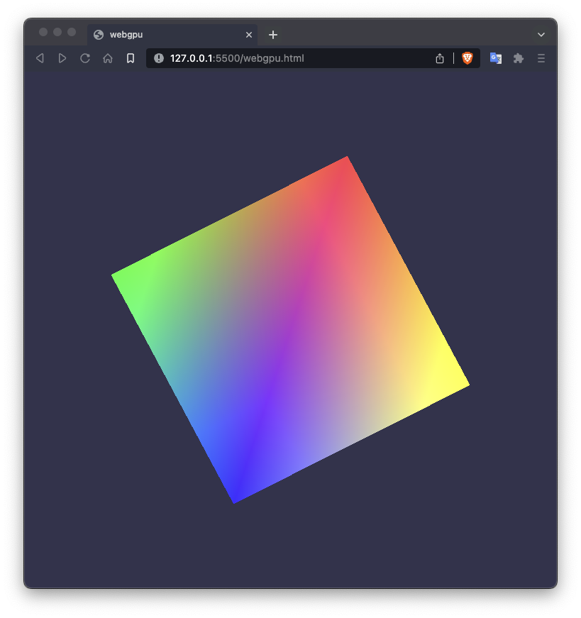

<div align="center">
<h1>webgpu-wasm-c</h1>

<p>A minimal WebGPU 3d example written in C, compiled to WebAssembly (wasm).</p>



</div>

## Getting started

### Clone

```bash
git clone https://github.com/seyhajin/webgpu-wasm-c.git
```

Alternatively, download [zip](https://github.com/seyhajin/webgpu-wasm-c/archive/refs/heads/master.zip) from Github repository and extract wherever you want.

### Build

Build the example will generate 3 new files (`.html`, `.js`, `.wasm`).

Launch build script according to your system :

**Windows**

```batch
build.bat
```

**Linux & MacOS**

```bash
sh build.bat
```

Alternatively, type the below command to build example (all platforms):

```bash
emcc main.c -o webgpu.html --shell-file shell.html -s -USE_WEBGPU=1
```

### Run

Launch a web server to run example before open it to WebGPU compatible web browser (Chrome Canary, Brave Nightly, etc.).

e.g. : launch `python3 -m http.server` and open web browser to `localhost:8000`.

**TIP**: Use [Live Server](https://marketplace.visualstudio.com/items?itemName=ritwickdey.LiveServer) extension in Visual Studio Code to open the HTML file. This extension will update automatically page in real-time when you rebuild the example.

## Prerequisites

* [emscripten](https://emscripten.org)
* git (optional)
* python3 (optional)
